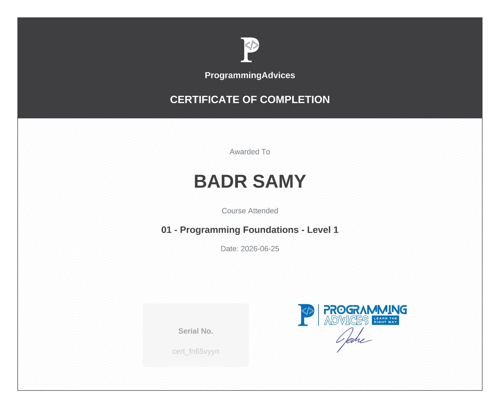

# 📜 Certificates & Learning Roadmap

Welcome to my learning showcase! This repository documents my completed courses, detailed key learnings, and official certificates earned on the **ProgrammingAdvices** platform, taught by Eng. Mohammed Abu-Hadhoud.

---

## 🔹 01 - Programming Foundations - Level 1

### 🎓 Completion Certificate
* **Serial No.:** `cert_fn65vyyn`[cite: 1]
* **Completion Date:** June 25, 2026[cite: 1]

### 📌 What I Learned
During this foundational course, I built a strong mental model of how computer systems work under the hood before jumping into code syntax:
* **Computer Architecture:** Understanding computer logic, memory allocation basics, and processing execution flow.
* **Number Systems:** Learned representation systems used in digital computing: Binary (Base 2), Octal (Base 8), and Hexadecimal (Base 16).
* **Core Problem-Solving:** Gained fundamental computational insights required for learning actual programming languages and structured algorithms.

---

## 🔹 02 - Algorithms & Problem-Solving Level 1

### 🎓 Completion Certificate
* **Serial No.:** `cert_mz0dyqz9`[cite: 1]
* **Completion Date:** June 27, 2026[cite: 1]

### 📌 What I Learned
In this course, I transitioned from hardware concepts to pure logic and systematic thinking:
* **Algorithmic Thinking:** Breaking complex problems down into small, solvable, step-by-step procedures.
* **Flowcharts & Pseudocode:** Designing clear visual representations and language-agnostic logic before writing code.
* **Logic & Math Applications:** Solved dozens of practical logic puzzles, mathematical conditions, and procedural challenges.

---

## 🔹 03 - Introduction to Programming with C++ - Level 1

### 🎓 Completion Certificate
* **Serial No.:** `cert_59d9xln7`[cite: 1]
* **Completion Date:** July 22, 2026[cite: 1]

### 📌 What I Learned
Here I applied my foundational logic and algorithm skills directly into real C++ code:
* **C++ Basics & Syntax:** Mastered variables, data types, operators, and standard I/O streams (`cin`/`cout`).
* **Control Flow:** Implemented conditional decision-making (`if/else`, `switch`) and iteration mechanics (`for`, `while`, `do-while` loops).
* **Arrays & Searching:** Handled fixed-size arrays, indexing, element traversal, and search logic with `break` and `continue`.
* **Functions:** Structured clean, modular, and reusable code by writing custom functions and passing parameters.

---

> *"Continuous learning is the minimal requirement for success in any field."*

